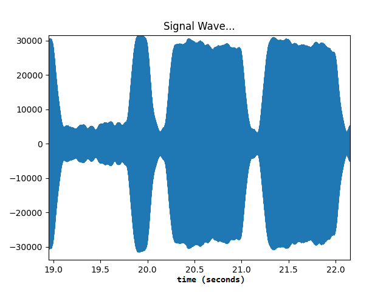
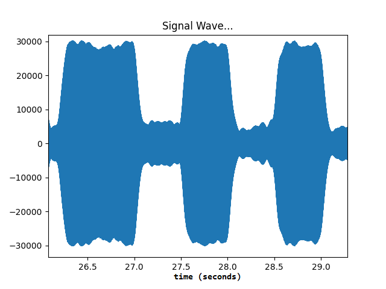

# WWVB

This program reads and decodes 1000 Hz modulated audio according to the [WWVB](https://en.wikipedia.org/wiki/WWVB) modulation standard.  WWVB is a radio station operated by the National Institute of Standards and Technology (NIST) from Fort Collins, Colorado.  It broadcasts the current time and date on a 60 kHz channel, which reaches most of the continental United States for use by clocks and watches to automatically set the time.

This low frequency uses ground propagation to reach most of the country, and although best reception can be found during the overnight hours, it works remarkably well most days on the east coast as well.  However, a properly tuned antenna would need to be some large proportion of the wavelength of the signal, and even a one-quarter wavelength antenna at this frequency would measure about 3 quarters of a mile in length!  Because the WWVB signal consists of a slow and simple modulation strategy, its signal can be heard by devices with tiny inefficient antennas (small enough to fit in a wristwatch!).  

This modulation strategy is called [Pulse-Width Modulation (PWM)](https://en.wikipedia.org/wiki/Pulse-width_modulation).  WWVB uses three kinds of data values that it sends using this modulation: a 0, a 1, and a marker bit.  Sending a single bit takes one whole second, and during that second, a weak attenuated signal is sent followed by a stronger signal.  The duration (or width) of that attenuated signal tells us what kind of bit we have.  Here are the durations of each bit sent in a one second period:

|   **Bit**  | **Attenuated Signal Width** | **Strong Signal Width** |
|:----------:|:---------------------------:|-------------------------|
|    **0**   |            200 ms           |          800 ms         |
|    **1**   |            500 ms           |          500 ms         |
| **Marker** |            800 ms           |          200 ms         |

Here is an example signal that sends a marker bit followed by two zero bits.  Notice that the first bit is quiet for almost one second (0.8 seconds), and then loud for the remainder of the second (0.2 seconds).  That's a marker.  The second and third bits reverse that trend, and a requiet for only 0.2 seconds and then loud for the remainder of the second (0.8 seconds).  These are zero bits.  This signal transmitted a marker, followed by a 0, followed by a 0.

Here's another example that sends a zero, a one, and a one bit.

If we listen carefully (or observe the strength of the radio signal), we can decipher the entire code.  Over the course of one minute, WWVB will send 60 bit signals.  Each one tells us something about the current time.  Here's what they mean:

| **Bit** |                                        **Meaning**                                        |
|:-------:|:-----------------------------------------------------------------------------------------:|
|  **0**  |                                           Marker                                          |
|  **1**  |                              Add 40 to the number of minutes                              |
|  **2**  |                              Add 20 to the number of minutes                              |
|  **3**  |                              Add 10 to the number of minutes                              |
|  **4**  |                                           Unused                                          |
|  **5**  |                               Add 8 to the number of minutes                              |
|  **6**  |                               Add 4 to the number of minutes                              |
|  **7**  |                               Add 2 to the number of minutes                              |
|  **8**  |                               Add 1 to the number of minutes                              |
|  **9**  |                                           Marker                                          |
|  **10** |                                           Unused                                          |
|  **11** |                                           Unused                                          |
|  **12** |           Add 20 to the number of hours (0 is midnight, 13 is 1 PM, 23 is 11 PM)          |
|  **13** |                               Add 10 to the number of hours                               |
|  **14** |                                           Unused                                          |
|  **15** |                                Add 8 to the number of hours                               |
|  **16** |                                Add 4 to the number of hours                               |
|  **17** |                                Add 2 to the number of hours                               |
|  **18** |                                Add 1 to the number of hours                               |
|  **19** |                                           Marker                                          |
|  **20** |                                           Unused                                          |
|  **21** |                                           Unused                                          |
|  **22** |                  Add 200 to the number of days this year (1 is January 1)                 |
|  **23** |                               Add 100 to the day of the year                              |
|  **24** |                                           Unused                                          |
|  **25** |                               Add 80 to the day of the year                               |
|  **26** |                               Add 40 to the day of the year                               |
|  **27** |                               Add 20 to the day of the year                               |
|  **28** |                               Add 10 to the day of the year                               |
|  **29** |                                           Marker                                          |
|  **30** |                                Add 8 to the day of the year                               |
|  **31** |                                Add 4 to the day of the year                               |
|  **32** |                                Add 2 to the day of the year                               |
|  **33** |                                Add 1 to the day of the year                               |
|  **34** |                                           Unused                                          |
|  **35** |                                           Unused                                          |
|  **36** |                                   DUT1 Time Correction +                                  |
|  **37** |                                   DUT1 Time Correction -                                  |
|  **38** |                                   DUT1 Time Correction +                                  |
|  **39** |                                           Marker                                          |
|  **40** |     DUT1 Time Correction of 0.8 seconds (add or subtract this from the current minute)    |
|  **41** |                            DUT1 Time Correction of 0.4 seconds                            |
|  **42** |                            DUT1 Time Correction of 0.2 seconds                            |
|  **43** |                            DUT1 Time Correction of 0.1 seconds                            |
|  **44** |                                           Unused                                          |
|  **45** |             Add 80 to the 2-digit year (you need to know the current century!)            |
|  **46** |                                 Add 40 to the 2-digit year                                |
|  **47** |                                 Add 20 to the 2-digit year                                |
|  **48** |                                 Add 10 to the 2-digit year                                |
|  **49** |                                           Marker                                          |
|  **50** |                                 Add 8 to the 2-digit year                                 |
|  **51** |                                 Add 4 to the 2-digit year                                 |
|  **52** |                                 Add 2 to the 2-digit year                                 |
|  **53** |                                 Add 1 to the 2-digit year                                 |
|  **54** |                                           Unused                                          |
|  **55** |                                         Leap Year?                                        |
|  **56** |                                        Leap Second?                                       |
|  **57** | Daylight Saving Time? (00 = standard time, 01 = DST ending, 02 = DST beginning= 03 = DST) |
|  **58** |                                   Daylight Saving Time?                                   |
|  **59** |                                           Marker                                          |

You could tune in and listen to the signal, and you'd hear something like this.  The tone is modulated onto the 60 kHz signal at 1000 Hz, and you can hear it get weaker and stronger each second:

<iframe width="560" height="315" src="https://www.youtube.com/embed/0m5AT67Apvs" title="YouTube video player" frameborder="0" allow="accelerometer; autoplay; clipboard-write; encrypted-media; gyroscope; picture-in-picture" allowfullscreen></iframe>

## Youtube Decoder
